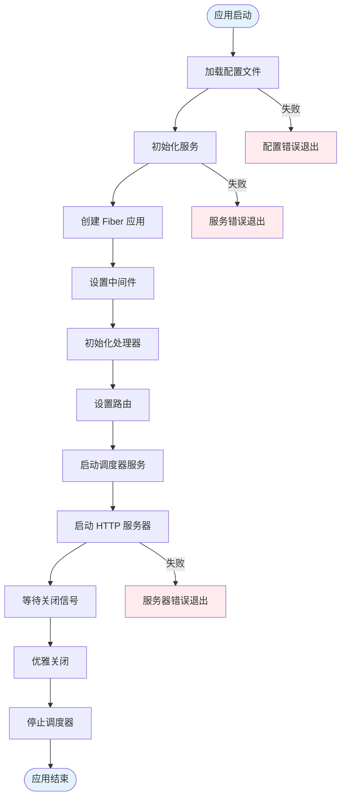
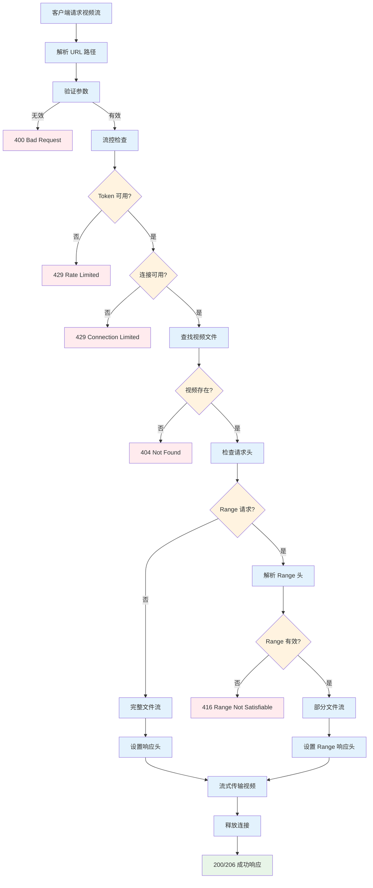
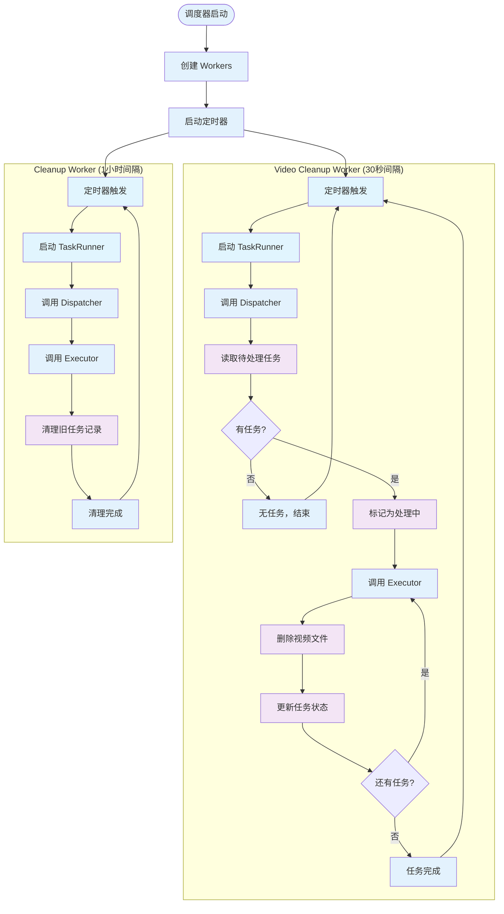
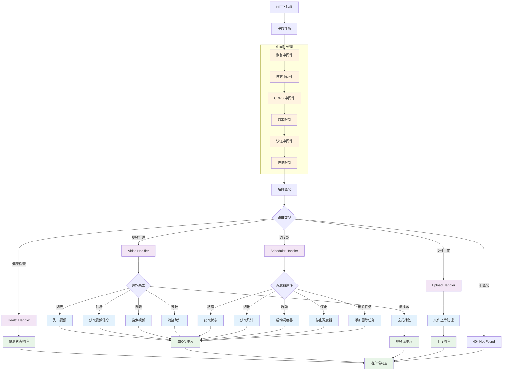
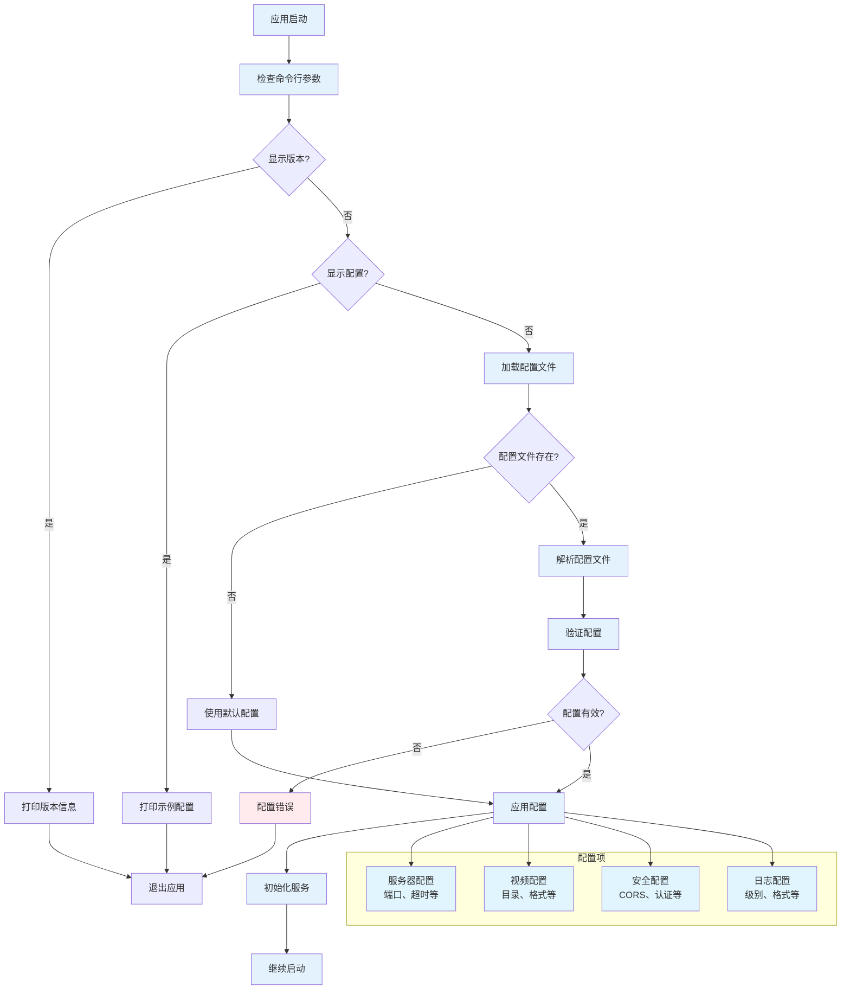

# 应用流程文档

## 应用启动流程

```mermaid
flowchart TD
    Start([应用启动]) --> LoadConfig[加载配置文件]
    LoadConfig --> InitServices[初始化服务]
    InitServices --> CreateApp[创建 Fiber 应用]
    CreateApp --> SetupMiddleware[设置中间件]
    SetupMiddleware --> InitHandlers[初始化处理器]
    InitHandlers --> SetupRoutes[设置路由]
    SetupRoutes --> StartScheduler[启动调度器服务]
    StartScheduler --> StartServer[启动 HTTP 服务器]
    StartServer --> WaitSignal[等待关闭信号]
    WaitSignal --> GracefulShutdown[优雅关闭]
    GracefulShutdown --> StopScheduler[停止调度器]
    StopScheduler --> End([应用结束])

    LoadConfig -->|失败| ConfigError[配置错误退出]
    InitServices -->|失败| ServiceError[服务错误退出]
    StartServer -->|失败| ServerError[服务器错误退出]

    classDef process fill:#e3f2fd
    classDef error fill:#ffebee
    classDef decision fill:#fff3e0

    class Start,End process
    class ConfigError,ServiceError,ServerError error
```

## 视频流播放流程

```mermaid
flowchart TD
    Request[客户端请求视频流] --> ParseURL[解析 URL 路径]
    ParseURL --> ValidateParams[验证参数]
    ValidateParams -->|无效| BadRequest[400 Bad Request]
    ValidateParams -->|有效| FlowControlCheck[流控检查]
    
    FlowControlCheck --> TokenCheck{Token 可用?}
    TokenCheck -->|否| RateLimit[429 Rate Limited]
    TokenCheck -->|是| ConnCheck{连接可用?}
    ConnCheck -->|否| ConnLimit[429 Connection Limited]
    ConnCheck -->|是| FindVideo[查找视频文件]
    
    FindVideo --> VideoExists{视频存在?}
    VideoExists -->|否| NotFound[404 Not Found]
    VideoExists -->|是| CheckHeaders[检查请求头]
    
    CheckHeaders --> RangeRequest{Range 请求?}
    RangeRequest -->|是| ParseRange[解析 Range 头]
    RangeRequest -->|否| FullStream[完整文件流]
    
    ParseRange --> ValidateRange{Range 有效?}
    ValidateRange -->|否| InvalidRange[416 Range Not Satisfiable]
    ValidateRange -->|是| PartialStream[部分文件流]
    
    FullStream --> SetHeaders[设置响应头]
    PartialStream --> SetRangeHeaders[设置 Range 响应头]
    
    SetHeaders --> StreamVideo[流式传输视频]
    SetRangeHeaders --> StreamVideo
    
    StreamVideo --> ReleaseConn[释放连接]
    ReleaseConn --> Success[200/206 成功响应]

    classDef success fill:#e8f5e8
    classDef error fill:#ffebee
    classDef process fill:#e3f2fd
    classDef decision fill:#fff3e0

    class Success success
    class BadRequest,RateLimit,ConnLimit,NotFound,InvalidRange error
    class Request,ParseURL,ValidateParams,FlowControlCheck,FindVideo,CheckHeaders,ParseRange,FullStream,PartialStream,SetHeaders,SetRangeHeaders,StreamVideo,ReleaseConn process
    class TokenCheck,ConnCheck,VideoExists,RangeRequest,ValidateRange decision
```

## 调度器任务执行流程

```mermaid
flowchart TD
    Start([调度器启动]) --> CreateWorkers[创建 Workers]
    CreateWorkers --> StartTimers[启动定时器]
    
    subgraph "Video Cleanup Worker (30秒间隔)"
        Timer1[定时器触发] --> StartRunner1[启动 TaskRunner]
        StartRunner1 --> Dispatch1[调用 Dispatcher]
        Dispatch1 --> ReadTasks[读取待处理任务]
        ReadTasks --> HasTasks{有任务?}
        HasTasks -->|否| NoTasks[无任务，结束]
        HasTasks -->|是| MarkProcessing[标记为处理中]
        MarkProcessing --> Execute1[调用 Executor]
        Execute1 --> DeleteFiles[删除视频文件]
        DeleteFiles --> UpdateStatus[更新任务状态]
        UpdateStatus --> CheckNext{还有任务?}
        CheckNext -->|是| Execute1
        CheckNext -->|否| Complete1[任务完成]
    end
    
    subgraph "Cleanup Worker (1小时间隔)"
        Timer2[定时器触发] --> StartRunner2[启动 TaskRunner]
        StartRunner2 --> Dispatch2[调用 Dispatcher]
        Dispatch2 --> Execute2[调用 Executor]
        Execute2 --> CleanupOld[清理旧任务记录]
        CleanupOld --> Complete2[清理完成]
    end
    
    StartTimers --> Timer1
    StartTimers --> Timer2
    
    Complete1 --> Timer1
    Complete2 --> Timer2
    NoTasks --> Timer1

    classDef worker fill:#e1f5fe
    classDef task fill:#f3e5f5
    classDef process fill:#e3f2fd

    class Timer1,Timer2,StartRunner1,StartRunner2 worker
    class ReadTasks,MarkProcessing,DeleteFiles,UpdateStatus,CleanupOld task
    class Start,CreateWorkers,StartTimers,Dispatch1,Execute1,Dispatch2,Execute2,Complete1,Complete2,NoTasks process
```

## API 请求处理流程

```mermaid
flowchart TD
    Request[HTTP 请求] --> Middleware[中间件链]
    
    subgraph "中间件处理"
        Recovery[恢复中间件] --> Logging[日志中间件]
        Logging --> CORS[CORS 中间件]
        CORS --> RateLimit[速率限制]
        RateLimit --> Auth[认证中间件]
        Auth --> ConnLimit[连接限制]
    end
    
    Middleware --> Recovery
    ConnLimit --> Routing[路由匹配]
    
    Routing --> RouteType{路由类型}
    
    RouteType -->|健康检查| HealthHandler[Health Handler]
    RouteType -->|视频管理| VideoHandler[Video Handler]
    RouteType -->|文件上传| UploadHandler[Upload Handler]
    RouteType -->|调度器| SchedulerHandler[Scheduler Handler]
    RouteType -->|未匹配| NotFound[404 Not Found]
    
    HealthHandler --> HealthResponse[健康状态响应]
    VideoHandler --> VideoOperation{操作类型}
    UploadHandler --> UploadProcess[文件上传处理]
    SchedulerHandler --> SchedulerOperation{调度器操作}
    
    VideoOperation -->|列表| ListVideos[列出视频]
    VideoOperation -->|信息| GetVideoInfo[获取视频信息]
    VideoOperation -->|流播放| StreamVideo[流式播放]
    VideoOperation -->|搜索| SearchVideos[搜索视频]
    VideoOperation -->|统计| FlowStats[流控统计]
    
    SchedulerOperation -->|状态| GetStatus[获取状态]
    SchedulerOperation -->|统计| GetStats[获取统计]
    SchedulerOperation -->|启动| StartScheduler[启动调度器]
    SchedulerOperation -->|停止| StopScheduler[停止调度器]
    SchedulerOperation -->|删除任务| AddDeletionTask[添加删除任务]
    
    ListVideos --> JSONResponse[JSON 响应]
    GetVideoInfo --> JSONResponse
    SearchVideos --> JSONResponse
    FlowStats --> JSONResponse
    GetStatus --> JSONResponse
    GetStats --> JSONResponse
    StartScheduler --> JSONResponse
    StopScheduler --> JSONResponse
    AddDeletionTask --> JSONResponse
    
    StreamVideo --> VideoStream[视频流响应]
    UploadProcess --> UploadResponse[上传响应]
    HealthResponse --> ClientResponse[客户端响应]
    JSONResponse --> ClientResponse
    VideoStream --> ClientResponse
    UploadResponse --> ClientResponse
    NotFound --> ClientResponse

    classDef middleware fill:#fff3e0
    classDef handler fill:#f3e5f5
    classDef operation fill:#e3f2fd
    classDef response fill:#e8f5e8

    class Recovery,Logging,CORS,RateLimit,Auth,ConnLimit middleware
    class HealthHandler,VideoHandler,UploadHandler,SchedulerHandler handler
    class ListVideos,GetVideoInfo,StreamVideo,SearchVideos,FlowStats,GetStatus,GetStats,StartScheduler,StopScheduler,AddDeletionTask,UploadProcess operation
    class HealthResponse,JSONResponse,VideoStream,UploadResponse,ClientResponse response
```

## 配置管理流程

```mermaid
flowchart TD
    AppStart[应用启动] --> CheckFlags[检查命令行参数]
    CheckFlags --> ShowVersion{显示版本?}
    ShowVersion -->|是| PrintVersion[打印版本信息]
    ShowVersion -->|否| ShowConfig{显示配置?}
    ShowConfig -->|是| PrintConfig[打印示例配置]
    ShowConfig -->|否| LoadConfig[加载配置文件]
    
    LoadConfig --> ConfigFile{配置文件存在?}
    ConfigFile -->|否| DefaultConfig[使用默认配置]
    ConfigFile -->|是| ParseConfig[解析配置文件]
    
    ParseConfig --> ValidateConfig[验证配置]
    ValidateConfig --> ConfigValid{配置有效?}
    ConfigValid -->|否| ConfigError[配置错误]
    ConfigValid -->|是| ApplyConfig[应用配置]
    
    DefaultConfig --> ApplyConfig
    ApplyConfig --> InitServices[初始化服务]
    
    subgraph "配置项"
        ServerConfig[服务器配置<br/>端口、超时等]
        VideoConfig[视频配置<br/>目录、格式等]
        SecurityConfig[安全配置<br/>CORS、认证等]
        LoggingConfig[日志配置<br/>级别、格式等]
    end
    
    ApplyConfig --> ServerConfig
    ApplyConfig --> VideoConfig
    ApplyConfig --> SecurityConfig
    ApplyConfig --> LoggingConfig
    
    PrintVersion --> Exit[退出应用]
    PrintConfig --> Exit
    ConfigError --> Exit
    InitServices --> Continue[继续启动]

    classDef config fill:#e1f5fe
    classDef error fill:#ffebee
    classDef process fill:#e3f2fd

    class ServerConfig,VideoConfig,SecurityConfig,LoggingConfig config
    class ConfigError error
    class AppStart,CheckFlags,LoadConfig,ParseConfig,ValidateConfig,ApplyConfig,InitServices,Continue process
```