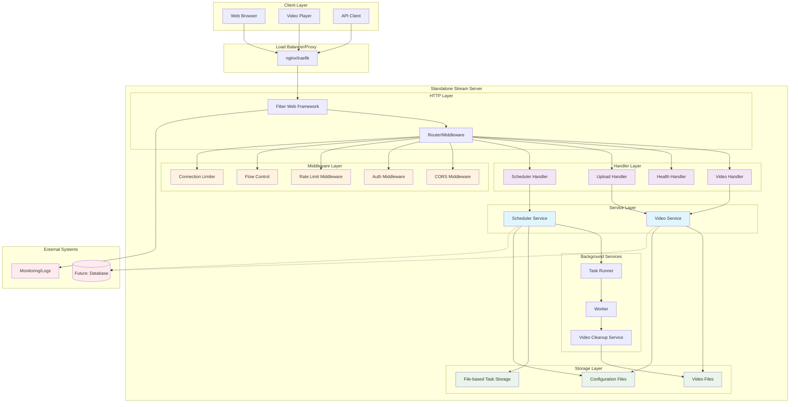
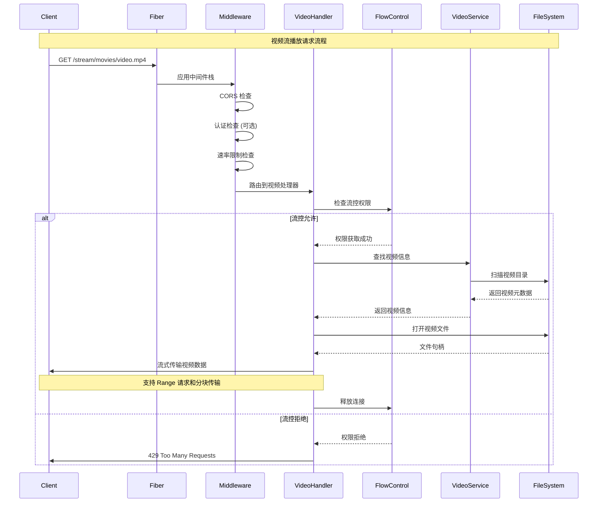
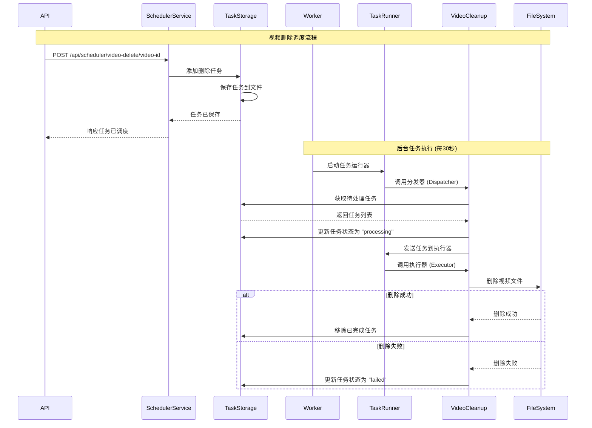
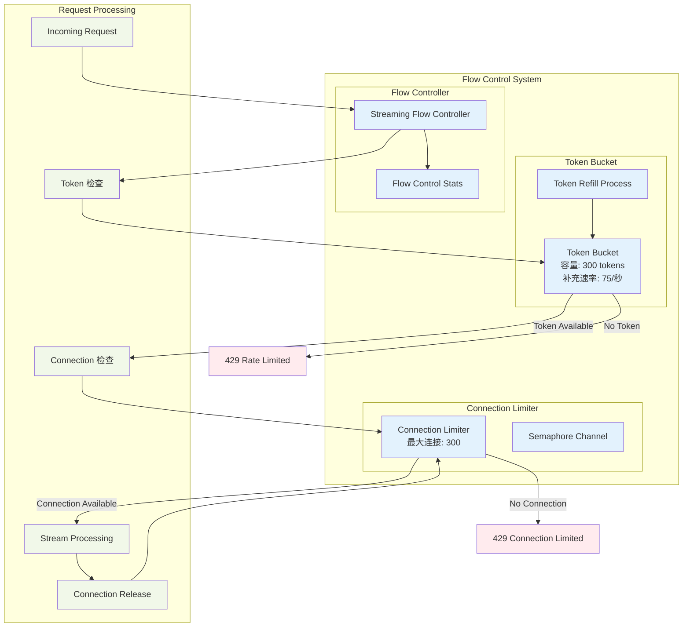

# 系统架构图

## 整体系统架构

```mermaid
graph TB
    subgraph "Client Layer"
        Browser[Web Browser]
        Player[Video Player]
        API[API Client]
    end

    subgraph "Load Balancer/Proxy"
        LB[nginx/traefik]
    end

    subgraph "Standalone Stream Server"
        subgraph "HTTP Layer"
            Fiber[Fiber Web Framework]
            Router[Router/Middleware]
        end

        subgraph "Handler Layer"
            VideoH[Video Handler]
            HealthH[Health Handler]
            UploadH[Upload Handler]
            SchedulerH[Scheduler Handler]
        end

        subgraph "Service Layer"
            VideoS[Video Service]
            SchedulerS[Scheduler Service]
        end

        subgraph "Middleware Layer"
            CORS[CORS Middleware]
            Auth[Auth Middleware]
            RateLimit[Rate Limit Middleware]
            FlowControl[Flow Control]
            ConnLimit[Connection Limiter]
        end

        subgraph "Background Services"
            TaskRunner[Task Runner]
            Worker[Worker]
            VideoCleanup[Video Cleanup Service]
        end

        subgraph "Storage Layer"
            FileStorage[File-based Task Storage]
            VideoFiles[Video Files]
            ConfigFiles[Configuration Files]
        end
    end

    subgraph "External Systems"
        Monitoring[Monitoring/Logs]
        DB[(Future: Database)]
    end

    Browser --> LB
    Player --> LB
    API --> LB
    LB --> Fiber

    Fiber --> Router
    Router --> VideoH
    Router --> HealthH
    Router --> UploadH
    Router --> SchedulerH

    Router --> CORS
    Router --> Auth
    Router --> RateLimit
    Router --> FlowControl
    Router --> ConnLimit

    VideoH --> VideoS
    SchedulerH --> SchedulerS
    UploadH --> VideoS

    SchedulerS --> TaskRunner
    TaskRunner --> Worker
    Worker --> VideoCleanup

    VideoS --> VideoFiles
    SchedulerS --> FileStorage
    VideoCleanup --> VideoFiles

    VideoS --> ConfigFiles
    SchedulerS --> ConfigFiles

    Fiber --> Monitoring
    SchedulerS -.-> DB
    VideoS -.-> DB

    classDef service fill:#e1f5fe
    classDef handler fill:#f3e5f5
    classDef middleware fill:#fff3e0
    classDef storage fill:#e8f5e8
    classDef external fill:#ffebee

    class VideoS,SchedulerS service
    class VideoH,HealthH,UploadH,SchedulerH handler
    class CORS,Auth,RateLimit,FlowControl,ConnLimit middleware
    class FileStorage,VideoFiles,ConfigFiles storage
    class Monitoring,DB external
```

## 数据流程图

```mermaid
sequenceDiagram
    participant Client
    participant Fiber
    participant Middleware
    participant VideoHandler
    participant FlowControl
    participant VideoService
    participant FileSystem

    Note over Client,FileSystem: 视频流播放请求流程

    Client->>Fiber: GET /stream/movies/video.mp4
    Fiber->>Middleware: 应用中间件栈
    
    Middleware->>Middleware: CORS 检查
    Middleware->>Middleware: 认证检查 (可选)
    Middleware->>Middleware: 速率限制检查
    
    Middleware->>VideoHandler: 路由到视频处理器
    VideoHandler->>FlowControl: 检查流控权限
    
    alt 流控允许
        FlowControl-->>VideoHandler: 权限获取成功
        VideoHandler->>VideoService: 查找视频信息
        VideoService->>FileSystem: 扫描视频目录
        FileSystem-->>VideoService: 返回视频元数据
        VideoService-->>VideoHandler: 返回视频信息
        
        VideoHandler->>FileSystem: 打开视频文件
        FileSystem-->>VideoHandler: 文件句柄
        
        VideoHandler->>Client: 流式传输视频数据
        Note over VideoHandler,Client: 支持 Range 请求和分块传输
        
        VideoHandler->>FlowControl: 释放连接
    else 流控拒绝
        FlowControl-->>VideoHandler: 权限拒绝
        VideoHandler->>Client: 429 Too Many Requests
    end
```

## 调度器任务流程图

```mermaid
sequenceDiagram
    participant API
    participant SchedulerService
    participant TaskStorage
    participant Worker
    participant TaskRunner
    participant VideoCleanup
    participant FileSystem

    Note over API,FileSystem: 视频删除调度流程

    API->>SchedulerService: POST /api/scheduler/video-delete/video-id
    SchedulerService->>TaskStorage: 添加删除任务
    TaskStorage->>TaskStorage: 保存任务到文件
    TaskStorage-->>SchedulerService: 任务已保存
    SchedulerService-->>API: 响应任务已调度

    Note over Worker,FileSystem: 后台任务执行 (每30秒)

    Worker->>TaskRunner: 启动任务运行器
    TaskRunner->>VideoCleanup: 调用分发器 (Dispatcher)
    VideoCleanup->>TaskStorage: 获取待处理任务
    TaskStorage-->>VideoCleanup: 返回任务列表
    VideoCleanup->>TaskStorage: 更新任务状态为 "processing"
    VideoCleanup->>TaskRunner: 发送任务到执行器

    TaskRunner->>VideoCleanup: 调用执行器 (Executor)
    VideoCleanup->>FileSystem: 删除视频文件
    
    alt 删除成功
        FileSystem-->>VideoCleanup: 删除成功
        VideoCleanup->>TaskStorage: 移除已完成任务
    else 删除失败
        FileSystem-->>VideoCleanup: 删除失败
        VideoCleanup->>TaskStorage: 更新任务状态为 "failed"
    end
```

## 流控系统架构

```mermaid
graph TB
    subgraph "Flow Control System"
        subgraph "Token Bucket"
            TB[Token Bucket<br/>容量: 300 tokens<br/>补充速率: 75/秒]
            TBRefill[Token Refill Process]
        end

        subgraph "Connection Limiter"
            CL[Connection Limiter<br/>最大连接: 300]
            Semaphore[Semaphore Channel]
        end

        subgraph "Flow Controller"
            FC[Streaming Flow Controller]
            Stats[Flow Control Stats]
        end
    end

    subgraph "Request Processing"
        Request[Incoming Request]
        TokenCheck[Token 检查]
        ConnCheck[Connection 检查]
        Processing[Stream Processing]
        Release[Connection Release]
    end

    Request --> FC
    FC --> TokenCheck
    TokenCheck --> TB
    
    TB -->|Token Available| ConnCheck
    TB -->|No Token| RateLimit[429 Rate Limited]
    
    ConnCheck --> CL
    CL -->|Connection Available| Processing
    CL -->|No Connection| ConnLimit[429 Connection Limited]
    
    Processing --> Release
    Release --> CL

    TBRefill --> TB
    FC --> Stats

    classDef flowcontrol fill:#e3f2fd
    classDef process fill:#f1f8e9
    classDef error fill:#ffebee

    class TB,TBRefill,CL,Semaphore,FC,Stats flowcontrol
    class Request,TokenCheck,ConnCheck,Processing,Release process
    class RateLimit,ConnLimit error
```
